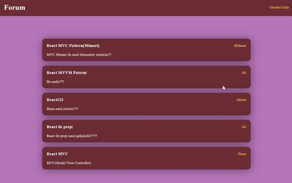

<h1>MVC Mimarisine Giriş: Basit Forum Uygulaması</h1>

Bu proje MVC (Model-View-Controller) mimarisini anlamak ve öğrenmek amacıyla oluşturulmuş basit bir forum uygulamasıdır. MVC mimarisi birçok yazılım geliştirme ortamında kullanılan bir tasarım desenidir ve uygulamanın farklı katmanlarını mantıklı bir şekilde organize etmeyi amaçlar.

<h2>MVC (Model View Controller) Nedir ve Niçin Kullanılır?</h2>
MVC, Model-View-Controller kelimelerinin kısaltmasıdır ve bir yazılım uygulamasının farklı katmanlarını organize etmek için kullanılan bir tasarım desenidir. MVC'nin temel prensibi uygulamanın veri işleme mantığını (Model), kullanıcı arayüzünü (View) ve kullanıcı etkileşimlerini yöneten kontrolörü (Controller) birbirinden bağımsız tutmaktır. Bu, uygulamanın daha modüler, bakımı daha kolay ve yeniden kullanılabilir olmasını sağlar.
<ul>
<li><b>Model:</b> Model, uygulamanın veri işleme mantığını temsil eder. Veritabanı işlemleri, veri manipülasyonu ve iş kurallarını içerir. Bu projede AddPostModel gibi model sınıfları kullanılarak verilerin yönetimi sağlanmıştır.</li>
<li><b>View (Görünüm):</b> View, kullanıcı arayüzünü temsil eder. Kullanıcıya sunulan görsel ve işlevsel öğeleri içerir. Bu projede ListPostView ve PopupView gibi görünüm bileşenleri kullanılarak kullanıcı arayüzü tasarlanmıştır.</li>
<li><b>Controller (Kontrolör):</b> Controller, kullanıcı etkileşimlerini yöneten ve Model ile View arasındaki iletişimi sağlayan bir ara katmandır. Bu projede, ListPostController ve PopupController gibi kontrolör bileşenleri kullanılarak iş mantığı yönetilmiştir.</li>

</ul>

<h2>Proje Özellikleri
</h2>

<ul>
<li>Kullanıcılar gönderi ekleyebilir.</li>
<li>Kullanıcılar gönderilere yorum yapabilir.</li>
<li>Kullanıcılar gönderileri görüntüleyebilir.</li>
<li>Kullanıcılar gönderilere tıkladıklarında ayrıntıları gösteren bir popup penceresi görüntülenebilir.</li>

</ul>

<h2>Kullanılan Teknolojiler</h2>

<ul>
<li>Axios</li>
<li>React-Router-Dom</li>
<li>Json-server</li>
<li>Sass</li>

</ul>

